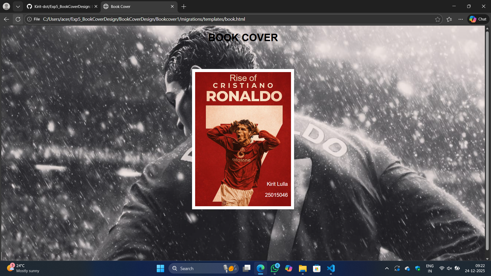

# Ex.05 Book Front Cover Page Design
## Date:24.12.25

## AIM:
To design a book front cover page using HTML and CSS.

## DESIGN STEPS:

### Step 1:
Create a Django Admin project.

### Step 2:
Create an app in the Django interface.

### Step 3:
Create a folder named 'static' in the app folder.

### Step 4:
Create a new HTML file in the static folder.

### Step 5:
Write the HTML code with relevant CSS properties.

### Step 6:
Choose the appropriate style and color scheme.

### Step 7:
Insert the images in their appropriate places.

### Step 8:
Publish the website in the LocalHost.

## PROGRAM:
```
<!DOCTYPE html>
<html>
<head>
    <title>Book Cover</title>

    <style>
        body {
            margin: 0;
            height: 100vh;
            background-image: url("real.jpg.jpeg");
            background-size: cover;
            background-position: center;
            text-align: center;
            font-family: Arial, sans-serif;
        }

        h1 {
            color: black;
            margin-top: 20px;
        }

        .book {
            width: 300px;
            height: 420px;
            margin: 80px auto;
            position: relative;
            border: 10px solid white;
            
        }

        .book img {
            width: 100%;
            height: 100%;
            object-fit: cover;
        }

        .title {
            position: absolute;
            top: 3px;
            width: 100%;
            text-align: center;
            font-size: 27px;
            font-weight: italic;
            color: #e8d3b5;
            
        }

        .author {
            position: absolute;
            bottom: 10px;
            right: 10px;
            text-align: right;
            font-size: 16px;
            color: white;
            
        }
    </style>
</head>

<body>

    <h1>BOOK COVER</h1>

    <div class="book">
        
        <div class="title">Rise of </div>
        <div class="author">
            <p>Kirit Lulla</p>
            <p>25015046</p>
        </div>
    </div>

</body>
</html>
```

## OUTPUT:


## RESULT:
The program for designing book front cover page using HTML and CSS is completed successfully.
